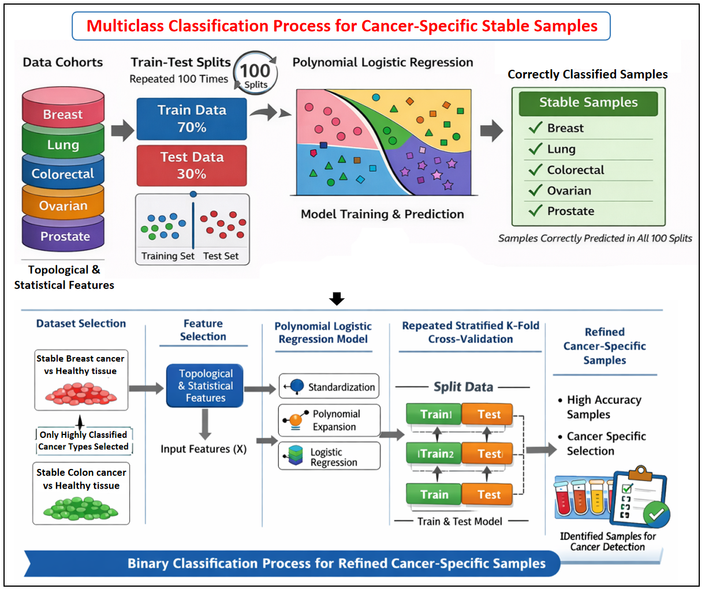
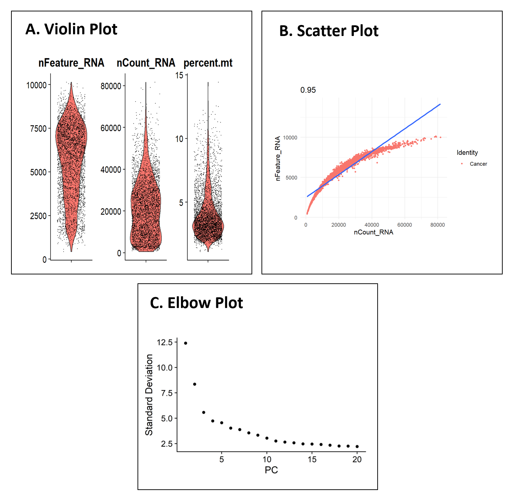
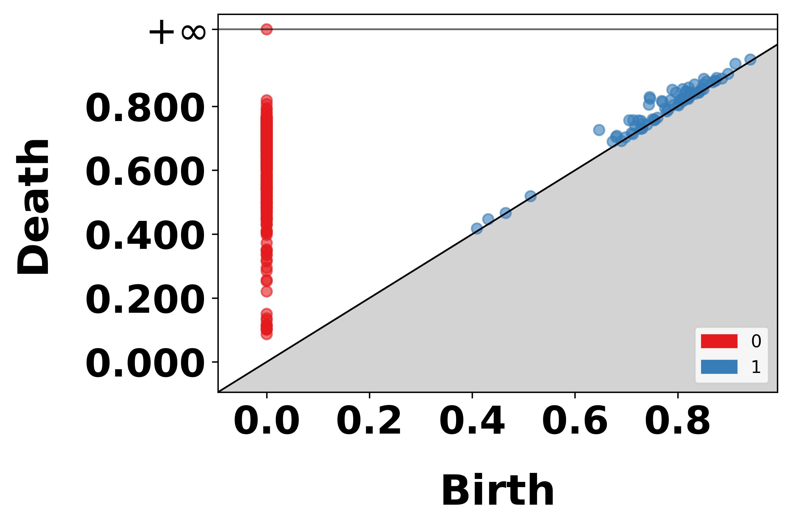

# 🧬 Topological Cancer Signature Pipeline (TDA-Based)


---

## 📌 Overview

This repository provides a **hybrid R + Python pipeline** for:

* Extracting **topological signatures** from scRNA-seq data
* Identifying **stable cancer samples**
* Performing **multi-class & binary classification**
* Discovering **robust, biologically significant genes**
* Generating **DEA-ready gene expression profiles**

The pipeline integrates:

* **Seurat (R)** for preprocessing
* **Topological Data Analysis (TDA)**
* **Machine Learning (Logistic Regression)**

---

## 🧠 Pipeline Workflow



```
scRNA-seq Data
     ↓
FindCorrMat (R)
     ↓
CancerCorrMat.csv
     ↓
Extract_Topological_Features (Python)
     ↓
Topological Features + Significant Genes
     ↓
Multiclass Classification
     ↓
Stable Samples
     ↓
Binary Classification
     ↓
Refined Stable Samples
     ↓
Topologically Significant Genes (≥50%)
     ↓
FindGeneProfile (R)
     ↓
DEA-ready Gene Profiles
```

---

## ⚙️ Installation

### 🔹 Clone Repository

```bash
git clone https://github.com/Sudarshan-Gogoi/Topological_Classification.git
cd Topological_Classification
```

---

### 🔹 Python Requirements

All Python scripts automatically install required packages.

Main dependencies:

* pandas
* numpy
* matplotlib
* gudhi
* persim
* scikit-learn
* mygene

---

### 🔹 R Requirements

Install in R:

```r
install.packages(c("Seurat","tidyverse","data.table","Hmisc","Matrix","readxl"))

if (!requireNamespace("BiocManager", quietly = TRUE))
    install.packages("BiocManager")

BiocManager::install(c("org.Hs.eg.db","AnnotationDbi"))
```

---

## 🚀 Step-by-Step Usage

---

### 🔹 Step 1: Generate Correlation Matrix (R)

Run:

```r
FindCorrMat(...)
```

📂 Output:

```
CancerCorrMat.csv
```

📊 Example Outputs:



---

### 🔹 Step 2: Extract Topological Features (Python)

Run:

```python
Extract_Topological_Features(...)
```

📂 Outputs:

* Topological_Features.xlsx
* SignificantGenes.csv
* Betti plots
* Persistence diagram
* Landscape plots



---

### 🔹 Step 3: Combine All Samples

Merge all feature files into:

```
TDA-Features.xlsx
```

Each row should include:

* Features
* Cohort label
* Dataset ID

---

### 🔹 Step 4: Multiclass Classification

Purpose:

* Classify cancer types
* Identify **stable samples**

Method:

* Polynomial Logistic Regression
* 100 repeated splits

📊 Output:

* Precision / Recall / F1-score
* Stable samples per cancer

---

### 🔹 Step 5: Binary Classification

Purpose:

* Cancer vs Healthy classification
* Refine stable samples

Method:

* Repeated Stratified K-Fold
* 100% specificity threshold

📊 Output:

* Mean accuracy
* High-confidence samples

---

### 🔹 Step 6: Integrate Topologically Significant Genes

Purpose:

* Convert Ensembl → Gene Symbols
* Select genes appearing in ≥50% samples

📂 Output:

```
CancerType_Top_Sig_Genes.csv
```

---

### 🔹 Step 7: Gene Expression Profile (R)

Run:

```r
FindGeneProfile(...)
```

📂 Outputs:

* Recurring genes
* Gene expression profiles
---

## 📊 Results

### ✔ Stable Samples

Highly reliable samples consistently classified across runs.

### ✔ Topological Features

* 0D & 1D persistence features
* Landscape-based metrics

### ✔ Topologically Significant Genes

* Robust genes appearing in ≥50% samples

### ✔ DEA-ready Profiles

Ready for downstream statistical validation.

---

## 📁 Repository Structure

```
├── R/
│   ├── FindCorrMat.R
│   └── FindGeneProfile.R
│
├── Python/
│   ├── Extract_Topological_Features.py
│   ├── Multiclass_Classification.py
│   ├── Binary_Classification.py
│   └── Gene_Integration.py
│
├── docs/
│   ├── pipeline_diagram.png
│   ├── persistence_diagram.png
│   └── qc_plots.png
│
├── data/
│   └── example_inputs/
│
└── README.md
```

---

## ⚠️ Notes

* Ensure consistent naming:

  * `"Breast"` vs `"Healthy Breast"`
* Gene IDs should be consistent (Ensembl vs Symbols)
* Stable samples = **high biological confidence**

---

## 🧪 Applications

* Cancer subtype classification
* Biomarker discovery
* Network biology
* Precision medicine

---

## 📜 License

MIT License

---

## 👨‍🔬 Citation

If you use this pipeline, please cite:

```
Gogoi S. et al. (2026)
Topological Cancer Signatures using scRNA-seq
```

---

## ⭐ Acknowledgements

* Seurat
* Gudhi
* Scikit-learn
* MyGene.info

---

## 💡 Future Work

* Deep learning integration
* Multi-omics extension
* Clinical validation

---
